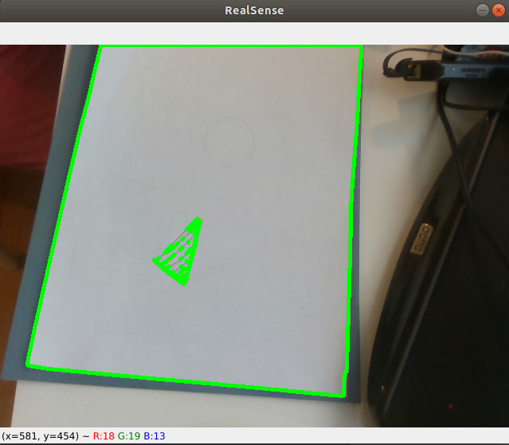

# Cognitive-Wiping-Robot
## Camera Setup
Install Intel® RealSense™ SDK 2.0 following [official instruction](https://github.com/IntelRealSense/librealsense/blob/development/doc/distribution_linux.md)

## Cognition
### Detect the Working area
Detect the largest [contour](https://opencv-python-tutroals.readthedocs.io/en/latest/py_tutorials/py_imgproc/py_contours/py_contour_features/py_contour_features.html) ```max_cnt``` as working area.
Optionally: 
- Detect the bounding rectangular or
- Detect the contour of largest white area.

### Detect the stains
Reserve the contours inside ```max_cnt``` as stains to be cleaned.



## Motion Planning
