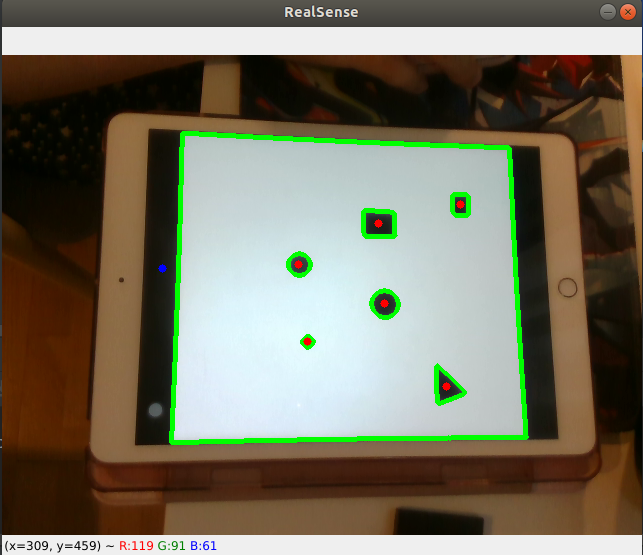
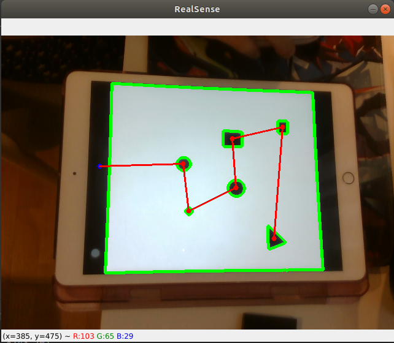

# Cognitive-Wiping-Robot
## Setup
### Library for camera
Install Intel® RealSense™ SDK 2.0 following [official instruction](https://github.com/IntelRealSense/librealsense/blob/development/doc/distribution_linux.md)
### Environment
This project uses python 3.7. To install required packages:
```
pip install -r requirements.txt
```

## Cognition
To detect stains and plan the motion of the end-effector:
```
python viewer.py
```

### Detect the Working area
Detect the largest [contour](https://opencv-python-tutroals.readthedocs.io/en/latest/py_tutorials/py_imgproc/py_contours/py_contour_features/py_contour_features.html) ```max_cnt``` as working area.
Optionally: 
- Detect the bounding rectangular or
- Detect the contour of largest white area.

### Detect the stains
Reserve only contours inside ```max_cnt``` as stains to be cleaned. Add centers of all stains (marked as red) as nodes for planning algorithms.

[](RealSense_Detect.png)

## Motion Planning
The task of passing all the nodes is formed as a [Traveling Salesman Problem](https://en.wikipedia.org/wiki/Travelling_salesman_problem#As_a_graph_problem), and will be solved by following algorithms.
### Nearst Neighbors
Starting from the initial position (current position of end effector, marked as blue), select the nearst node to be the next move.

[](RealSense_Planning.png)

### Ant colony optimization

## Demo
[](demo.gif)

