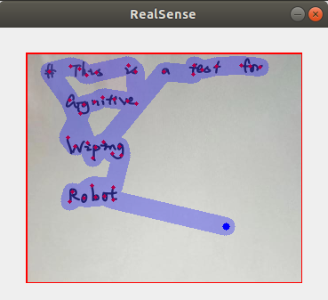
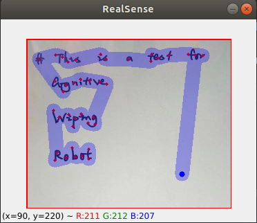
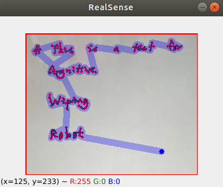

# Cognitive-Wiping-Robot
This project contains the visual cognition and motion planning part of a cognitive wiping robot. The task is assumed to be wiping off the words written on a white board.

[](wiping_task_words.png)

## Setup
### Library for camera
Install Intel® RealSense™ SDK 2.0 following [official instruction](https://github.com/IntelRealSense/librealsense/blob/development/doc/distribution_linux.md)
### Environment
This project uses python 3.7. To install required packages:
```
pip install -r requirements.txt
```

## Cognition
### Detect the Working area
Choose region of interest manually as working area. In this case, the largest [contour](https://opencv-python-tutroals.readthedocs.io/en/latest/py_tutorials/py_imgproc/py_contours/py_contour_features/py_contour_features.html) ```max_cnt``` is usually the bounding rectangular of RoI.
Optionally: 
- Detect the largest contour ```max_cnt``` or
- Detect the bounding rectangular or
- Detect the contour of largest white area as working area..

### Detect the stains
Default: Reserve only contours inside ```max_cnt``` as stains to be cleaned. 

[](contour_words.png)

Option 1: Bounding rectangles can be used instead of contours.

[](RealSense_words_detect.png)

However, the size of rectangular kernel needs to be set manually to get a suitable bounding rectangle.

### Covering SP
The wiping task can be formed as a [Covering Traveling Salesman Problem](https://www.scirp.org/journal/paperinformation.aspx?paperid=77781). To guarantee that the cleaner will pass each pixel of stains, each point on contours ```c``` is checked if it lies within an e-neighborhood of current nodes, where the value of e depends on the size of the tool (e.g. radius of the brush) used to accomplish the task. If not, ```c```  is added to the node_list.

[](nodes_words.png)

As is shown in the image above, blue point stands for the starting point, red points are all the nodes for planning algorithms and green shadows marks the area the brush covers. 
 

## Motion Planning
The task of passing all the nodes is then formed as a [Traveling Salesman Problem](https://en.wikipedia.org/wiki/Travelling_salesman_problem#As_a_graph_problem), and will be solved by following algorithms.
### Nearst Neighbors
Starting from the initial position (current position of end effector, marked as blue), select the nearst node to be the next move.

[](planned_path_nn_words.png)

### Dynamic Programming
The path is planned by dynamic programming. However, the computation time is relatively long.

### Ant Colony Algorithm
The path is planned by ant colony algorithm. Area covered by the brush along the path is marked as blue shadow.

Path planned with neighborhood radius ```e=10```:

[](planned_path_acs_words.png)

Path planned with neighborhood radius ```e=5```:

[](planned_path_acs_words_radius_5.png)


## Demo
To detect stains and plan the path of the end-effector:
```
python viewer.py
```
[](nn_demo.gif)

As is shown in the demo, the RoI is firstly selected as the working area. The planned path (marked as blue shadow) is always able to cover all the words.

Note that this demo uses Nearst Neighbor as planning algorithm. For more complex algorithms like Dynamic Programming and Ant Colony, real-time planning and response are not possible.

## Next Step
### Undirected Graph
Results above were obatined under the assumption that nodes are all connected to each other. This guarantees that a path will be found, but also leads to computational burdens in planning. To speed up the planning process, a graph G=(V,E) is constructed following steps in [J.Hess2012](https://ieeexplore.ieee.org/abstract/document/6385960). 
Each node is only connected to top k (default 5) nearest neighbors within a radius r (default 30). In this way, number of edges to be explored is cut down.

[](graph_words.png)

### Joint GTSP


